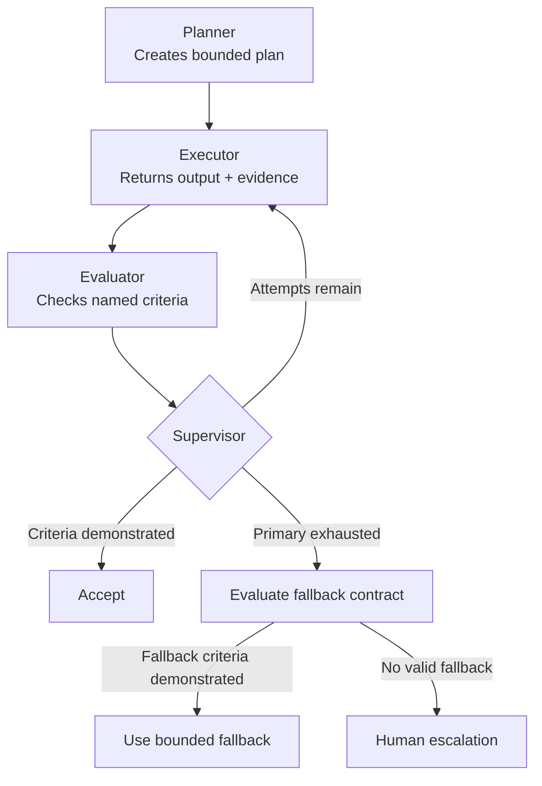

# Agent System Simulator

[](https://python.org)
[](LICENSE)
[](https://github.com/simaba/agent-simulator/commits/main)

A small, runnable simulator for inspecting bounded retries, evidence-gated acceptance, fallback contracts, and human escalation through working code.

## Why this repo exists

Agent control patterns can sound rigorous in prose while still relying on vague confidence scores or unexamined fallback behavior in code. This simulator keeps the state transitions visible:

- the planner produces a bounded plan;
- the executor returns an output plus observable evidence fields;
- the evaluator checks named acceptance criteria;
- the supervisor accepts, retries, evaluates a separate fallback contract, or escalates;
- the decision log records why each transition occurred.

A self-reported confidence value is retained in the fixture to demonstrate a specific point: **confidence is diagnostic metadata, not authorization**. A high-confidence result can fail when required evidence is absent, and a lower-confidence result can pass when every observable criterion is demonstrated.

## Choose this repo when

Use this repository when you want a concrete executable example of:

- bounded retries;
- explicit acceptance criteria;
- fallback behavior with its own contract;
- escalation when no authorized recovery path succeeds;
- traceable decision logs.

Use the companion repositories for broader treatment:

- [`multi-agent-governance`](https://github.com/simaba/multi-agent-governance) — authority, containment, recovery, and accountability;
- [`agent-orchestration`](https://github.com/simaba/agent-orchestration) — control-flow patterns and transition contracts;
- [`agent-eval`](https://github.com/simaba/agent-eval) — evaluation validity, suite design, and decision semantics.

## Control flow



## Acceptance contracts

The primary scenarios currently require three observable fixture fields:

| Criterion | Meaning in the simulator |
|---|---|
| `task_complete` | The scenario-defined task was completed rather than merely attempted |
| `output_present` | A non-empty output exists for the next control |
| `boundary_respected` | The scenario-defined action boundary was not crossed |

The fallback path has a separate contract. It must demonstrate an output, boundary compliance, and that the fallback itself is bounded. A fallback is not automatically acceptable merely because the primary path failed.

These booleans are deterministic simulator fixtures, not a claim that real agent quality can be reduced to three flags. In a real system, each criterion would need an operational definition, measurement instrument, version, provenance, and failure handling appropriate to the use case.

## Quick start

Python 3.10 or newer is required.

### Run directly from a source checkout

```bash
git clone https://github.com/simaba/agent-simulator.git
cd agent-simulator
python run_demo.py --scenario normal_success
```

The `run_demo.py` wrapper adds the local `src/` directory automatically, so no manual `PYTHONPATH` setup is needed.

### Install the CLI and run tests

```bash
python -m pip install -e ".[dev]"
agent-simulator --scenario retry_then_success
python -m pytest
```

Available scenarios:

```bash
python run_demo.py --scenario normal_success
python run_demo.py --scenario retry_then_success
python run_demo.py --scenario fallback_after_failure
python run_demo.py --scenario escalate_after_failure
```

## What each run produces

- the configured primary acceptance contract;
- executor evidence for each attempt;
- self-reported confidence, explicitly marked as non-authoritative;
- evaluator reasons and failed criteria;
- retry, fallback-contract, and escalation events;
- final outcome state;
- scenario-configured latency and cost fixture values.

`correctness_proxy` remains a backward-compatible simulator-state label derived from the configured outcome. It is not measured correctness, safety, or model performance and should not be used to compare systems.

See [`examples/sample-output.md`](examples/sample-output.md) for a full example run.

## Repository structure

```text
run_demo.py             # Self-contained checkout entry point
src/
  agents.py             # Agent roles, evidence fixture, and evaluator
  controller.py         # Orchestration, retry, fallback, and escalation logic
  evaluation.py         # Simulation report shape and rendering
  scenarios.py          # Scenario and acceptance-contract definitions
  cli.py                # Installed CLI entry point
tests/
  test_controller.py    # Path and evidence-gating tests
examples/
  sample-output.md      # Example run output
requirements.txt        # Runtime dependency note
pyproject.toml          # Packaging and test configuration
```

## Scope

This is a deterministic teaching simulator, not an LLM benchmark, production orchestrator, safety system, or proof that the illustrated controls are sufficient for a real deployment. Its value is that the control logic is small enough to inspect and test.

---

*Maintained by [Sima Bagheri](https://github.com/simaba).*
